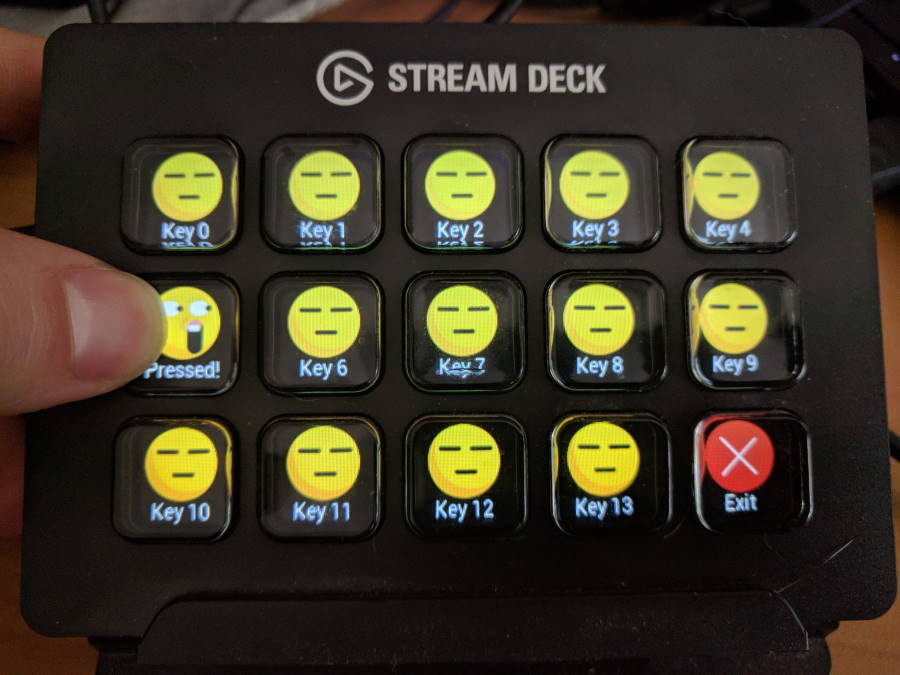
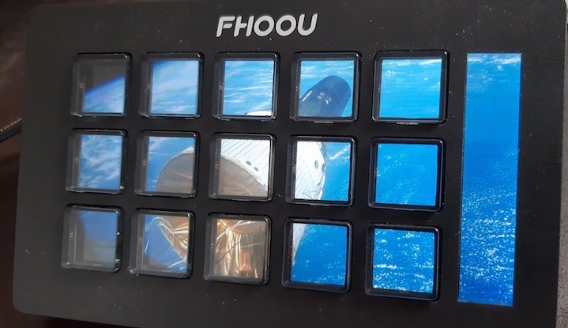

# Python Stream Doeck Library

 

This is an open source Python 3 library to control both [Elgato Stream Deck](https://www.elgato.com/en/gaming/stream-deck) as well the [Mirabox Stream Dock](https://miraboxbuy.com/collections/stream-dock) knock offs (and some exclusives) directly, without the official software. This can allow you to create your own custom front-ends, such as a custom control front-end for home automation software.

> [!NOTE]  
> This is a fork of [StreamController/streamcontroller-python-elgato-streamdeck](https://github.com/StreamController/streamcontroller-python-elgato-streamdeck), that on its turn it's a form from [abcminiuser/python-elgato-streamdeck](https://github.com/https://github.com/abcminiuser/python-elgato-streamdeck).

## Why "Doeck" ?

Because it supports both Elgato's Stream D**e**ck and Mirabox's Stream D**o**ck - I was tempted to name this "Stream Dick Library" (since "i" would be the middle ground between "e" and "o"), but Common Sense© prevailed. 😅


## Project Status:

Working:

* you can enumerate devices
* set the brightness of the panel(s)
* set the images shown on each button
* and read the current button states.

Currently the following products are supported in multiple hardware variants:

* Elgato
	+ StreamDeck Mini
	+ StreamDeck Neo
	+ StreamDeck Original
	+ StreamDeck Pedal
	+ StreamDeck Plus
	+ StreamDeck XL
* Mirabox
	+ StreamDock 293
	+ StreamDock 293S
	+ StreamDock N3

See [known issues](./KNOWN_ISSUES.md) for further information.


## Package Installation:

<!-- Install the library via pip:

```
pip install streamdeck
```
-->

Alternatively, manually clone the project repository:

```
git clone https://github.com/StreamDoeck/python-streamdoeck.git
```

For detailed installation instructions, build the documentation yourself locally by running `make html` from the `docs` directory.


## Credits:

See [Contributors](./CONTRIBUTORS.md) for details.


## License:

Released under the [GPLv2 license](./LICENSE).
