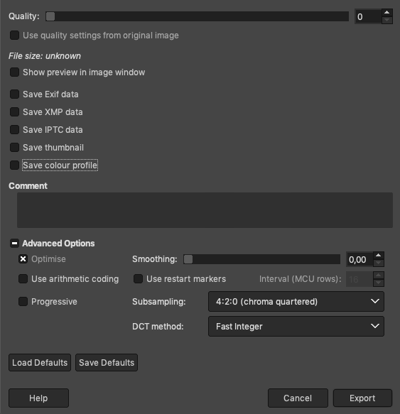

************
Blank Images
************

In the ``src/Assets`` directory you will find a series of jpg images
called ``blank-*``. These are the default images that are uploaded when
the ``set_key_image``, ``set_secondary_image``,
``set_touchscreen_image`` or ``set_screen_image`` are called with
``None`` on the ``image`` parameter.

You can replace them with anything you would like more as long its a
JPEG image. Do not use the ``Progressive`` option when exporting from
GIMP. Solid colours are best exported with maximum compression as
follows:

